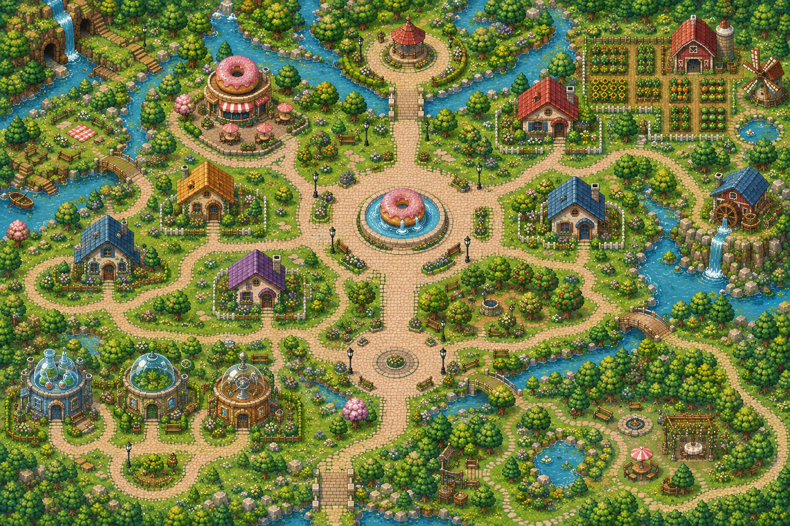
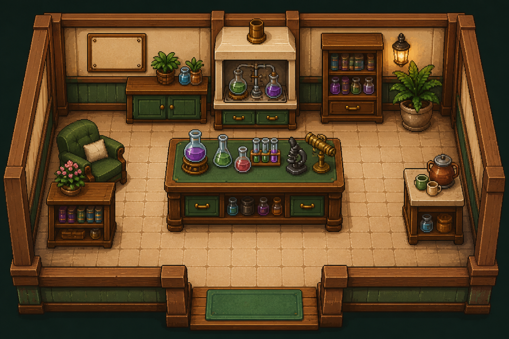

<div align="center">

# 🍩 Donut Town

[](LICENSE)

### Turn your Slack channel into a tiny pixel town.

Meet by the fountain. Invite someone for a chat. Make yourself at home.

[Deploy your town](docs/deploy.md) · [Let your agent set it up](docs/agent-deploy.md) · [Customize it](docs/customization.md)



</div>

Your teammates become pixel residents in a shared village. Meet by the fountain,
bring a pet on a walk, drop into the lab, or head home to rearrange your room.
When you want to catch up with someone, send a private Donut chat invitation
right from Town. Everyone enters through Slack, with no separate account to create.

## Life in Donut Town

**A village you can actually explore.** Walk the paths, cross bridges, visit the
gardens and enter Chem Pod. Keep the whole town in view or let the camera follow
you. Connected teammates move around in real time; supported characters settle
into reading, coffee, gardening and other activities when they stop nearby.

**A town that changes with the season.** Admins can preview and apply pixel map
themes from Settings. Halloween has a haunted manor, alchemy lab and new street
layout, with matching paths and activity spots. Add more with the [map-making skill](.agents/skills/donut-town-maps/SKILL.md).

**A character that feels like you.** Start with a pixel resident, then use the
included art workflow to create a character from your Slack avatar. Supported
wardrobes let you change clothing colors, shoes and eyewear while keeping the
same character. Walking animations and poses give residents a little personality.

**Your own Donut Home.** Everyone begins with the same starter room. Place and
rearrange owned furniture on the floor, add plants or seasonal decorations, and
save a space that feels yours. Placed decorations grow your home's **Luxury**
score from Simple through Cozy, Charming, Elegant, Luxurious and Grand. Visit a
neighbor’s Home, leave a note, bring flowers or gift a few donuts.

**A shop full of small possibilities.** Browse a wall of pixel goods, spend
donuts on available items and find new things for your Home. The catalog brings
together furniture, seasonal decorations, pets and character accessories, with
unfinished items clearly marked as previews.

**A companion for the walk.** Take an owned pet out with you. It follows your
route and waits when you stop; other connected members can see it beside you.

**Bake a connection.** Accept a Donut Chat invitation in Town or Slack. Both
residents become a pair, each earns **5 donuts**, and their baking station appears
in Donut Factory. The **Baking together** board shows this week’s pairs.

**A conversation close by.** Open a neighbor’s profile and send a private Town
message without leaving the map. Your Town inbox stays separate from Slack DMs.

**Friendships with a little history.** Invite a teammate to a Donut chat through
Slack, then find your matches in your profile. When both people confirm they
chatted, the shared history gains a completed chat and their friendship gains
points. The record is about meeting people; private Slack conversation text is
not collected.

<p align="center">
  
  <br />
  <em>A change of scenery, just a doorway away.</em>
</p>

## A town your team can keep building

New residents, outfits, furniture and rooms can grow with your team. The repo
includes reusable **agent skills** for pixel characters, walking animations,
accessories and interior design, including checks for scale, transparency and
walkable space. Art is created ahead of time and served as game assets; normal
play does not call an image-generation service.

**Your team hosts its own town.** One Slack workspace and one channel per
deployment. No Google Sheet, Apps Script or image-generation API key is required
to run it. The [setup guide](docs/deploy.md) handles the small Node.js service
and its Upstash database.

## Bring your team

You need permission to install a Slack app, a Render account and an Upstash
account. Your agent can prepare the files and check the setup; you authorize
account access and install the app.

1. **Fork this repo.** Your team controls its own code and updates.
2. **Create your Slack app from a generated manifest.** Scopes are already filled in.
3. **Deploy the included Render Blueprint** with your Slack and Upstash credentials.
4. **Generate the callback URLs**, save them in Slack, and add the entrance link to your channel.

The [deployment guide](docs/deploy.md) follows that exact order, including where
each credential lives and how to confirm it works. Start with messaging disabled,
then enable invitations after testing sign-in and storage.

### Prefer to hand it to an agent?

Copy this into your coding agent with the repository open:

```text
Set up Donut Town for my Slack workspace using docs/agent-deploy.md.
Use my fork and the included Render Blueprint. Generate the Slack manifest
with npm run setup, then run npm run doctor for configuration checks.
Reuse credentials already available through my authorized environment;
never print them or commit them. Ask me only for missing account access,
my target channel, and decisions that require my approval.
Keep Slack messaging disabled until I approve the intended test message.
Verify Slack sign-in, member access and saving a Home before calling it done.
Give me the channel entrance URL and any checks that remain unverified.
```

<details>
<summary><strong>Current scope and what's still coming</strong></summary>

- Connected players have real-time presence. Other resident placements represent the channel roster and do not mean those people are online.
- Personalized artwork is optional and prepared with the art skill. New workspaces receive starter appearances; wardrobe and pose support depend on each character's assets.
- New pairs earn **5 donuts per person**. The optional [Sheet Lottery connection](docs/lottery.md#connect-the-24-hour-pairing-to-town) excludes already-paired neighbors from the 24-hour draw and announces matches in the signup thread. Historical Lottery records are not imported. Some shop items are previews.
- Friendship points require both participants to confirm a chat. They record those confirmations, not independently verified attendance.
- Home visits, guestbooks, gifts and private Town messages require Redis. Guestbooks and conversations retain their latest 100 entries. See [interaction and storage rules](docs/town-social.md).
- Render's free instance sleeps after inactivity. Use an always-on instance for reliable Slack callbacks; see [hosting notes](docs/deploy.md#hosting-and-cost).

</details>

## Make this town your own

Want a different shop collection, a new room, or a new look? These are the
starting points for you or your agent:

| Change | Start here |
| --- | --- |
| Shop items, prices, starter allowance | [`content/shop.json`](content/shop.json) |
| Visits, private messages and pair rewards | [`docs/town-social.md`](docs/town-social.md) |
| Home furniture and Luxury tiers | [`docs/customization.md`](docs/customization.md) |
| Characters, animation and wardrobe | [Pixel-art skill](.agents/skills/donut-town-pixel-art/SKILL.md) |
| New rooms, scale and walkable floors | [Interior skill](.agents/skills/donut-town-interiors/SKILL.md) |
| Optional weekly Lottery automation | [`docs/lottery.md`](docs/lottery.md) |

## Develop locally

Use Node.js 22 or newer for the tooling (the server supports Node.js 20+).

```sh
npm ci
npm run setup
cp .env.example .env.local
# Fill .env.local with your own development credentials.
npm run doctor
npm start
```

Open `http://127.0.0.1:4173`. This is a Slack-connected app; without credentials,
the map waits for member sync. Direct local access can preview the UI, but member
writes require a Slack session. For login and interactive Slack callbacks, use
a public HTTPS development URL as described in the [guide](docs/deploy.md#local-development).

```sh
npm test
```

## Data and publishing

Slack profile photos stay in the live profile UI; original photos and raw member
IDs do not belong in Git. Generated game art can live in the repo. Character
bindings use keyed hashes, which are pseudonymous rather than anonymous.
Runtime Slack integration still processes member IDs. See [data and release notes](docs/publishing.md)
for what is stored and how to review a public release.

## License

Code, documentation, agent skills and project-created game assets are licensed
under [Apache-2.0](LICENSE), unless a file carries a separate notice. You can
deploy, modify and use them commercially under those terms. Original Slack
avatars and members' personal data are not included in this license. See
[asset scope and third-party notices](docs/publishing.md#license-and-assets).
